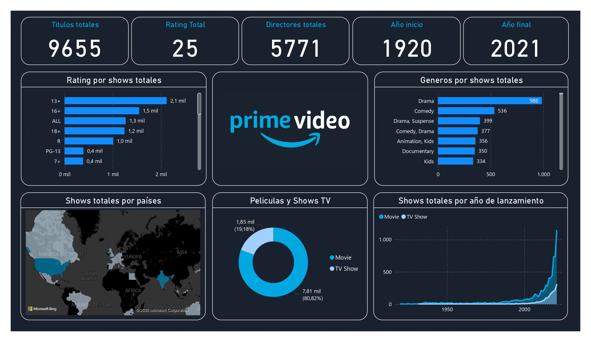

# PrimeAnalysis_PowerBI
This interactive Power BI dashboard provides a detailed analysis of Prime Video’s content, allowing users to explore key metrics related to its catalog, performance, and viewing trends.

## Key Features:
✅ Content Distribution – Analysis of the catalog by genre, release year, duration, and age rating.  
✅ Popularity & Ratings – Comparison of ratings and trends for the most-watched movies and series.  
✅ Temporal Analysis – Evolution of content added to the platform over time.  
✅ Country Comparison – Distribution of content based on availability in different regions.  
✅ Top Actors & Directors – Identification of the most prolific creators and talents on the platform.  

This dashboard is an ideal tool for researchers, analysts, and streaming enthusiasts looking to better understand Prime Video’s offerings and trends. 📊🎬
